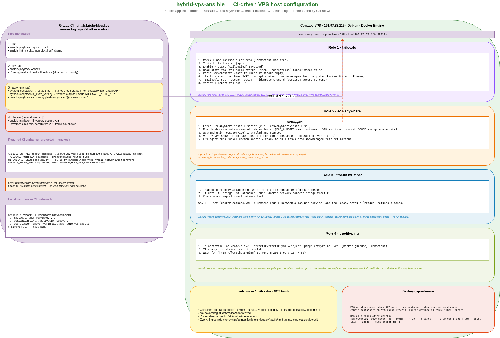

# hybrid-vps-ansible



Ansible playbook + roles that configure the **VPS side** of the hybrid architecture. Four roles applied in order:

| # | Role | What it does |
|---|---|---|
| 1 | `tailscale` | Installs Tailscale, joins tailnet, sets `--accept-routes` idempotent (persists across re-runs). Without this the VPS can't reach `10.230.0.0/16` in AWS. |
| 2 | `ecs-anywhere` | Installs the ECS Anywhere agent, registers the VPS as a container instance in cluster `p-hybrid-apis` using SSM activation code from `hybrid-networking-terraform/ecs-anywhere-activation/`. |
| 3 | `traefik-multinet` | Attaches Docker default `bridge` network to the running Traefik container so it can discover ECS Anywhere tasks (which are forced to `networkMode: bridge`). Idempotent. |
| 4 | `traefik-ping` | Enables Traefik's built-in `/ping` endpoint on entrypoint `web`. Used by the AWS ALB TG-vps health check (real Traefik liveness — no Host header needed). |

## CI/CD

Runs on the same shell-executor `vps` runner as the Terraform pipelines. `.gitlab-ci.yml` has 4 stages: `lint → dry-run → apply → destroy`.

**Required CI vars (protected+masked):**

| Var | Purpose |
|---|---|
| `ANSIBLE_SSH_KEY` | Base64-encoded `~/.ssh/claw_vps` private key (Ansible SSHs to `100.73.87.120:52222` as `claw`). |
| `TAILSCALE_AUTH_KEY` | Reusable + preauthorized-routes key. |
| `GITLAB_API_TOKEN` | Read-api PAT to pull `tf-outputs.json` from `hybrid-networking-terraform/eca:apply` artifact (cross-project `needs:` is EE-only, so we pull via API). |

**Destroy job** has `needs: []` — no dependency on apply, can run standalone.

## Ponte Terraform → Ansible

`ansible:apply` script fetches Terraform outputs from the upstream project:

```
scripts/pull_tf_outputs.py       # curl GitLab API → tf-outputs.json
scripts/build_extra_vars.py      # flatten TF outputs + inject tailscale_auth_key from env → extra-vars.json
ansible-playbook -i inventory playbook.yaml -e '@extra-vars.json'
```

Outputs consumed:
- `ssm_activation_id` (secret)
- `ssm_activation_code` (secret)
- `ecs_cluster_name`
- `aws_region`
- `tailscale_auth_key` (from `TAILSCALE_AUTH_KEY` env var, not TF output)

## Isolation

This playbook does **not** touch:
- Containers already on the `traefik-public` network (bussola, gitlab, mailcow, documind, etc.)
- Mailcow config at `/opt/mailcow-dockerized/`
- Global Docker daemon config

Only the Traefik container's network attachments and config file (`/home/claw/companies/kriolu-kloud.cv/traefik/traefik.yml`) are edited. `blockinfile` uses a marker so re-runs are idempotent.

## Local run (rare — CI is preferred)

```bash
ansible-playbook -i inventory playbook.yaml \
  -e "tailscale_auth_key=tskey-auth-..." \
  -e "activation_id=..." -e "activation_code=..." \
  -e "ecs_cluster_name=p-hybrid-apis" -e "aws_region=us-east-1"

# Single role:
ansible-playbook -i inventory playbook.yaml --tags ping
```

Convention: inventory host is `openclaw` (SSH alias in `~/.ssh/config`, port 52222).

## Destroy

`destroy.yaml` reverses each role: stops the ECS Anywhere agent, deregisters the VPS from the cluster, restores Traefik config, removes Tailscale routes.

**Known gap:** container cleanup isn't automatic after service drop. Zombie containers linger and cause Traefik "Router defined multiple times" errors. Manual after destroy:

```bash
ssh openclaw "sudo docker ps --format '{{.ID}} {{.Names}}' | grep 'ecs-p-app' | awk '{print \$1}' | xargs -r sudo docker rm -f"
```

## Status

**Live via CI.** Playbook + all 4 roles applied successfully. Destroy pipeline tested end-to-end.
